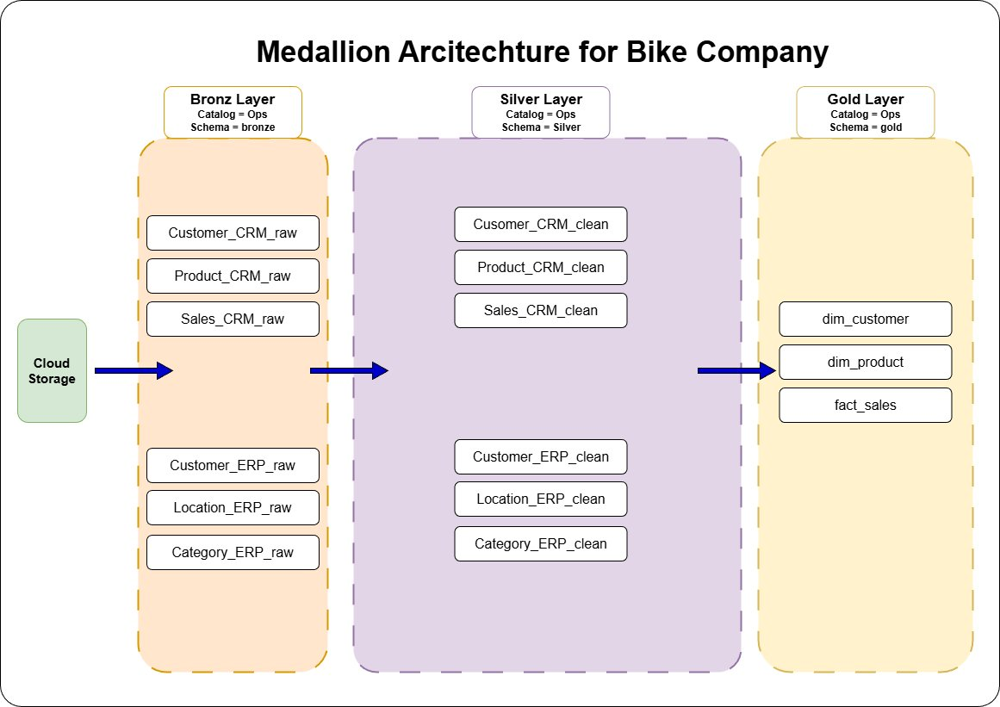
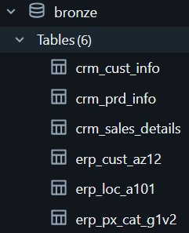
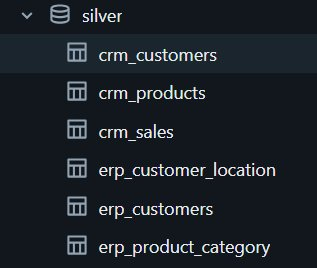
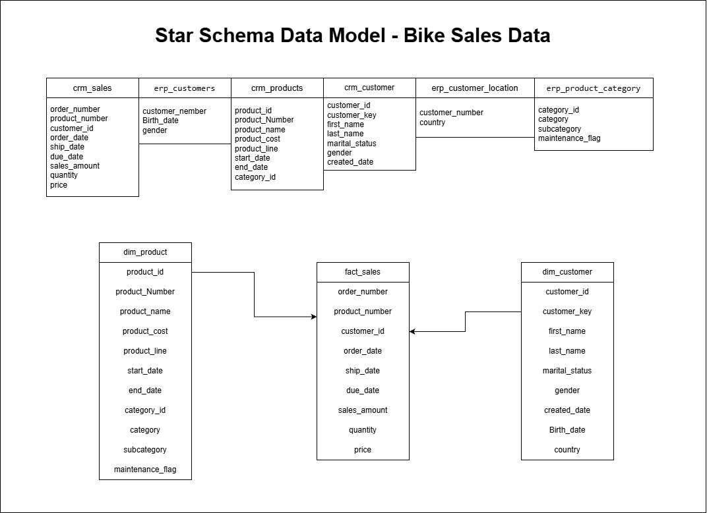
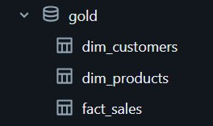
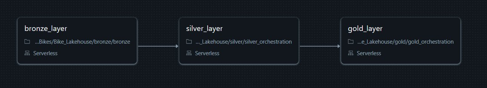

# 🚲 Bikes Data Lakehouse — Databricks Medallion Architecture

A production-style data lakehouse pipeline built on **Databricks** that takes raw sales data from a bike company and transforms it into clean, analytics-ready gold tables — ready for reporting and dashboarding.


---

## 📌 Project Overview

The goal of this project is to design and implement an end-to-end data lakehouse using the **Medallion Architecture** (Bronze → Silver → Gold) on Databricks. Raw CSV files from two source systems — a CRM and an ERP — are ingested, cleaned, transformed, and modeled into a star schema that supports business intelligence use cases like sales performance dashboards.

---

## 🏗️ Architecture



All three layers live as **separate schemas** inside a **Unity Catalog** workspace (`workspace.bronze`, `workspace.silver`, `workspace.gold`).

---

## 📁 Repository Structure

```
Bike_Lakehouse/
│
├── bronze/
│   └── bronze.ipynb                    # Ingests all 6 raw CSVs into bronze Delta tables
│
├── silver/
│   ├── silver_orchestration.ipynb      # Orchestrates all 6 silver notebooks
│   ├── crm/
│   │   ├── silver_crm_cust_info.ipynb
│   │   ├── silver_crm_prd_info.ipynb
│   │   └── silver_crm_sales_details.ipynb
│   └── erp/
│       ├── silver_erp_cust_az12.ipynb
│       ├── silver_erp_loc_a101.ipynb
│       └── silver_erp_px_cat_g1v2.ipynb
│
└── gold/
    ├── gold_orchestration.ipynb        # Orchestrates all 3 gold notebooks
    ├── gold_dim_customer.ipynb
    ├── gold_dim_product.ipynb
    └── gold_fact_sales.ipynb
```

---

## 🥉 Bronze Layer — Raw Ingestion

**Notebook:** `bronze/bronze.ipynb`

The bronze layer reads six CSV files stored in a Unity Catalog **Volume** (`/Volumes/workspace/bronze/source_systems/`) and writes each one as a raw Delta table with no transformation applied — preserving the data exactly as it arrived from the source systems.

To keep the ingestion logic clean and DRY, all six tables are loaded using a single **for-loop** over an `INGESTION_CONFIG` list:

| Source | CSV File | Bronze Table |
|--------|----------|--------------|
| CRM | `cust_info.csv` | `bronze.crm_cust_info` |
| CRM | `prd_info.csv` | `bronze.crm_prd_info` |
| CRM | `sales_details.csv` | `bronze.crm_sales_details` |
| ERP | `CUST_AZ12.csv` | `bronze.erp_cust_az12` |
| ERP | `LOC_A101.csv` | `bronze.erp_loc_a101` |
| ERP | `PX_CAT_G1V2.csv` | `bronze.erp_px_cat_g1v2` |



---

## 🥈 Silver Layer — Cleaning & Transformation

**Orchestration:** `silver/silver_orchestration.ipynb`
Each table has its own dedicated notebook. The orchestration notebook runs all six sequentially using `dbutils.notebook.run()`.



### CRM Tables

#### `silver.crm_customers` ← `bronze.crm_cust_info`
- Trimmed all string columns
- Normalized `marital_status`: `"M"` → `"Married"`, `"S"` → `"Single"`, else `"n/a"`
- Normalized `gender`: `"M"` → `"Male"`, `"F"` → `"Female"`, else `"n/a"`
- Removed records with null `customer_id`
- Renamed all columns to readable English names

#### `silver.crm_products` ← `bronze.crm_prd_info`
- Trimmed all string columns
- **Parsed the product key**: extracted a `category_id` from the first 5 characters (replacing `-` with `_`), and stripped the prefix from `product_key`
- Replaced null `product_cost` with `0` using `coalesce`
- Normalized `product_line` codes: `"M"` → `"Mountain"`, `"R"` → `"Road"`, `"T"` → `"Touring"`, `"S"` → `"Other Sales"`
- Cast `start_date` to `DateType`
- Renamed all columns to readable English names

#### `silver.crm_sales` ← `bronze.crm_sales_details`
- Trimmed all string columns
- **Date cleaning**: invalid date values (zero or not 8 digits) are set to `null`; valid values are parsed from `yyyyMMdd` format
- **Price correction**: if `price` is null or zero, it's recalculated as `sales_amount / quantity`
- Renamed all columns to readable English names

### ERP Tables

#### `silver.erp_customers` ← `bronze.erp_cust_az12`
- Trimmed all string columns
- **Customer ID cleanup**: stripped the `"NAS"` prefix from IDs where present
- **Birthdate validation**: future birthdates are set to `null`
- Normalized `gender` with multiple accepted spellings: `"M"/"Male"` → `"Male"`, `"F"/"Female"` → `"Female"`
- Renamed columns

#### `silver.erp_customer_location` ← `bronze.erp_loc_a101`
- Trimmed all string columns
- **Country normalization**: standardized abbreviations (`"US"/"USA"` → `"United States"`, `"DE"` → `"Germany"`) and filtered unrecognized values to `"n/a"`
- **Customer ID cleanup**: removed `-` dashes from IDs
- Renamed columns

#### `silver.erp_product_category` ← `bronze.erp_px_cat_g1v2`
- Trimmed all string columns
- Converted `maintenance` flag from `"YES"/"NO"` strings to proper `Boolean` values
- Renamed columns to `category_id`, `category`, `subcategory`, `maintenance_flag`

---

## 🥇 Gold Layer — Star Schema

**Orchestration:** `gold/gold_orchestration.ipynb`
Three gold notebooks are run sequentially — dimensions first, then the fact table.

The gold layer models the data into a **star schema** optimized for BI reporting:





### `gold.dim_customers`
Joins `silver.crm_customers`, `silver.erp_customers`, and `silver.erp_customer_location` on `customer_number`.
- Generates a surrogate `customer_key` using `ROW_NUMBER()`
- **Gender deduplication logic**: CRM gender is preferred; ERP gender is used as fallback via `COALESCE`
- Final fields: `customer_key`, `customer_id`, `customer_number`, `first_name`, `last_name`, `country`, `marital_status`, `gender`, `birth_date`, `created_date`

### `gold.dim_products`
Joins `silver.crm_products` with `silver.erp_product_category` on `category_id`.
- Generates a surrogate `product_key` using `ROW_NUMBER()` ordered by `start_date` and `product_number`
- Final fields: `product_key`, `product_id`, `product_number`, `product_name`, `category`, `subcategory`, `maintenance_flag`, `product_line`, `start_date`

### `gold.fact_sales`
Joins `silver.crm_sales` with `dim_customers` and `dim_products` to resolve surrogate keys.
- Final fields: `order_number`, `product_key`, `customer_key`, `order_date`, `ship_date`, `due_date`, `sales_amount`, `quantity`, `price`

---

## ⚙️ Orchestration & Scheduling

Two orchestration notebooks handle the pipeline flow using `dbutils.notebook.run()`:

| Orchestration Notebook | Runs |
|------------------------|------|
| `silver_orchestration.ipynb` | All 6 silver notebooks sequentially |
| `gold_orchestration.ipynb` | All 3 gold notebooks sequentially |

A **Databricks Job** runs the full pipeline daily at **3:00 AM** with tasks in this order:



```
[bronze_layer] → [silver_layer] → [gold_layer]
```

---

## 🛠️ Tech Stack

| Tool | Role |
|------|------|
| **Databricks** | Unified data platform (compute + orchestration) |
| **Unity Catalog** | Governance and schema management (bronze / silver / gold) |
| **Delta Lake** | Storage format for all tables |
| **PySpark** | All data transformations |
| **SQL** | Gold layer modeling queries |
| **Databricks Volumes** | Raw CSV file storage |
| **Databricks Jobs** | Scheduled daily pipeline execution |

---

## 🚀 How to Run

1. **Upload the raw CSV files** to your Unity Catalog Volume at:
   ```
   /Volumes/workspace/bronze/source_systems/source_crm/
   /Volumes/workspace/bronze/source_systems/source_erp/
   ```

2. **Import the notebooks** into your Databricks workspace, preserving the folder structure.

3. **Create Unity Catalog schemas** if they don't already exist:
   ```sql
   CREATE SCHEMA IF NOT EXISTS workspace.bronze;
   CREATE SCHEMA IF NOT EXISTS workspace.silver;
   CREATE SCHEMA IF NOT EXISTS workspace.gold;
   ```

4. **Run manually** in order:
   - `bronze/bronze.ipynb`
   - `silver/silver_orchestration.ipynb`
   - `gold/gold_orchestration.ipynb`

5. **Or schedule** a Databricks Job with the three tasks in sequence, set to run daily at 3:00 AM.

---

## 📊 Output

After the pipeline runs, the gold layer is ready for BI tools (Power BI, Tableau, Databricks SQL, etc.):

| Table | Type | Description |
|-------|------|-------------|
| `gold.dim_customers` | Dimension | Unified customer profile from CRM + ERP |
| `gold.dim_products` | Dimension | Product catalog enriched with category info |
| `gold.fact_sales` | Fact | Sales transactions linked via surrogate keys |

---

## 🙏 Credits

This project was built by following the **DataWithBaraa Databricks Bootcamp**. Thanks to Baraa for the structured curriculum and real-world dataset.

| Resource | Link |
|----------|------|
| 📺 YouTube Playlist | [Databricks Bootcamp 2026](https://www.youtube.com/playlist?list=PLNcg_FV9n7qZoxVkw-KPhcmgLWjHWVUc9) |
| 💻 Source Repository | [DataWithBaraa GitHub](https://github.com/DataWithBaraa/databricks_bootcamp_2026) |
